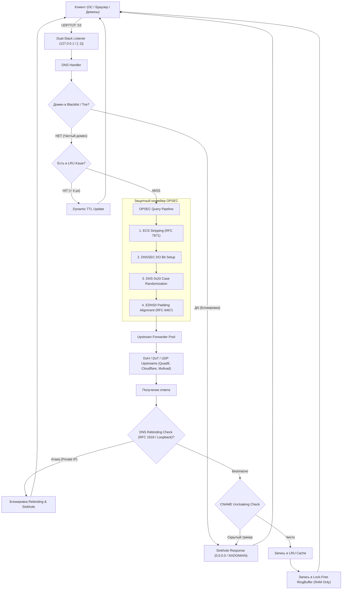

# TuxDNS-Hole 🐧🛡️

[](https://github.com/kondrakov408-sys/TuxDNS-Hole/actions/workflows/ci.yml)
[](https://goreportcard.com/report/github.com/kondrakov408-sys/TuxDNS-Hole)
[](LICENSE)
[](go.mod)

**TuxDNS-Hole** — высокопроизводительный, бескомпромиссно приватный локальный DNS-sinkhole демон на **Go 1.22+** для Linux с нулевым дисковым следом (**Zero-Disk Footprint**) и полной защитой от сетевого профилирования.

---

## 🎯 Какую проблему решает TuxDNS-Hole?

Большинство пользователей и системных администраторов сталкиваются со следующими критическими уязвимостями приватности и производительности:

```
┌───────────────────────────────────────────────────────────────────────────────────────────────────┐
│                                 ТИПИЧНЫЕ УГРОЗЫ И ПРОБЛЕМЫ DNS                                    │
├────────────────────────────────┬────────────────────────────────┬────────────────────────────────┤
│ 1. Утечка провайдеру (ISP)     │ 2. Фингерпринтинг DoH          │ 3. Деанонимизация через ECS    │
│ Стандартный DNS (UDP 53) идет  │ DoH шифрует текст, но размер   │ Резолверы передают клиентскую  │
│ открытым текстом. Провайдер    │ пакетов выдает запрашиваемый   │ подсеть (RFC 7871), выдавая    │
│ логирует каждый домен системы. │ URL по базам длин запросов.    │ ваше реальное местоположение.  │
├────────────────────────────────┼────────────────────────────────┼────────────────────────────────┤
│ 4. Атаки DNS Rebinding         │ 5. Отравление кэша (Poisoning) │ 6. Диск-форензика & Оверхед    │
│ Внешний сайт резолвится в      │ Подделка ответов апстрима      │ Тяжелые панели (Pi-hole, AGH)  │
│ 127.0.0.1 / 192.168.x.x, взла- │ и захват DNS-транзакций в      │ пишут гигабайты логов на SSD   │
│ мывая локальные веб-сервисы.   │ ненадежных сетях.              │ и потребляют 300+ МБ ОЗУ.      │
└────────────────────────────────┴────────────────────────────────┴────────────────────────────────┘
```

### 🛡️ Как TuxDNS-Hole устраняет эти угрозы:

1. **Глобальный системный Sinkhole:** Перехватывает DNS-запросы от всех приложений, системных демонов, Docker-контейнеров и браузеров на `127.0.0.1:53` / `[::1]:53`. Блокирует трекеры, телеметрию ОС и рекламу с отдачей `0.0.0.0` / `::` или `NXDOMAIN`.
2. **EDNS0 Padding (RFC 7830 / RFC 8467):** Дополняет исходящие зашифрованные пакеты до фиксированного кратного размера (блок 128 байт), полностью уничтожая возможность определения посещаемого сайта по длине пакета.
3. **Бескомпромиссный ECS Stripping (RFC 7871):** Принудительно вырезает любые метаданные клиентской подсети (EDNS Client Subnet) перед отправкой в DoH/DoT.
4. **Защита от DNS Rebinding:** Фильтрует ответы на публичные домены, если они содержат адреса локальных подсетей (RFC 1918, Loopback, Link-Local, CGNAT), предотвращая атаки на роутеры и локальные сервисы, сохраняя доступ к доверенным доменам (`*.lan`, `*.local`, `router.lan`).
5. **DNS 0x20 Bit Case Randomization:** Случайно варьирует регистр символов (`gOoGlE.cOm`) для защиты от спуфинга и отравления DNS-кэша с мягким fallback-восстановлением.
6. **Zero-Disk Footprint (Anti-Forensics):** Полный отказ от SQLite и дисковых логов. История запросов хранится исключительно в lock-free кольцевом буфере в оперативной памяти и бесследно стирается при выключении питания.
7. **Экстремальная скорость:** In-Memory LRU кэш отдает закэшированные запросы за **< 4 микросекунды** (~0.004 мс), а фильтрация 1 000 000+ доменов через суффиксное дерево (Trie) и хеш-индекс выполняется за **~80 наносекунд** без аллокаций в куче.

---

## 🏗️ Архитектура обработки запроса



---

## ⚡ Сравнение с аналогами

| Критерий | TuxDNS-Hole | Pi-hole | AdGuard Home | Blocky |
| :--- | :---: | :---: | :---: | :---: |
| **Язык разработки** | **Go (Native Binary)** | C / PHP / Shell | Go | Go |
| **Потребление ОЗУ (1M правил)** | **~20–25 MB** | ~120–200 MB | ~150–300 MB | ~80–120 MB |
| **Время ответа из кэша** | **~4 µs (0.004 ms)** | ~0.5–1.0 ms | ~0.3–0.8 ms | ~0.2–0.5 ms |
| **Дисковые логи (Forensics)** | **0% (Только RAM)** | SQLite на SSD | SQLite / WAL | Опционально |
| **EDNS0 Padding (RFC 8467)** | **Встроено (128B)** | ❌ Нет | ❌ Нет | ❌ Нет |
| **DNS 0x20 Randomization** | **Встроено** | ❌ Нет | ❌ Нет | ❌ Нет |
| **DNS Rebinding Protection** | **Встроено** | ⚠️ Частично | ⚠️ Частично | ⚠️ Частично |
| **Non-blocking Live Reload** | **Atomic / RCU** | Перезапуск FTL | Блокировка | Блокировка |
| **Внешние зависимости** | **0 (Один статический бинарник)** | Веб-сервер, PHP, SQLite | Веб-сервер, Node/Assets | Нет |

---

## 🚀 Быстрый старт и установка

### 1. Требования
* Linux (любой дистрибутив: Ubuntu/Debian, Arch Linux, Fedora, Alpine, RHEL)
* Go 1.22+ (для сборки из исходников)
* `make` и права `sudo`

### 2. Сборка и установка одной командой

```bash
# Клонирование репозитория
git clone https://github.com/kondrakov408-sys/TuxDNS-Hole.git
cd TuxDNS-Hole

# Сборка и установка бинарника, конфигурации и hardened systemd службы
sudo make install
```

Файлы размещаются в системе:
* Бинарник: `/usr/local/bin/tuxdnshole`
* Конфигурация: `/etc/tuxdnshole/config.yaml`
* Служба Systemd: `/etc/systemd/system/tuxdnshole.service`
* Харденинг ядра sysctl: `/etc/sysctl.d/99-tuxdns-security.conf`

---

## 🔧 Правильная системная интеграция (3 шага)

### Шаг 1. Активация службы TuxDNS-Hole
```bash
sudo make service
# Или вручную:
sudo systemctl enable --now tuxdnshole
```

Проверьте статус службы:
```bash
systemctl status tuxdnshole
```

### Шаг 2. Применение параметров безопасности ядра (Sysctl)
Примените сетевой харденинг против IP-спуфинга, атак на TCP-сокеты и манипуляций BPF JIT:
```bash
sudo make harden
# Или вручную:
sudo install -m 644 configs/99-tuxdns-security.conf /etc/sysctl.d/99-tuxdns-security.conf
sudo sysctl --system
```

### Шаг 3. Привязка `/etc/resolv.conf` без перехвата NetworkManager / systemd-resolved
Чтобы система направляла весь трафик в локальный sinkhole и настройки не сбрасывались после перезагрузки:

```bash
sudo make setup-resolv
# Или запустите скрипт напрямую:
sudo ./scripts/setup-resolvconf.sh
```

> **Что делает скрипт:**
> 1. Отключает конфликтующий `systemd-resolved` (`DNSStubListener=no`).
> 2. Прописывает `nameserver 127.0.0.1` и `nameserver ::1` в `/etc/resolv.conf`.
> 3. Ставит атрибут неизменяемости `chattr +i /etc/resolv.conf`, защищая файл от перезаписи DHCP-клиентами и NetworkManager.

---

## 🔍 Проверка работоспособности и верификация

### 1. Проверка блокировки рекламы и телеметрии
Отправьте запрос к заблокированному домену:
```bash
dig @127.0.0.1 telemetry.microsoft.com A +short
# Результат: 0.0.0.0 (запрос моментально синкхолится)
```

### 2. Проверка легитимных доменов через зашифрованный DoH Upstream
```bash
dig @127.0.0.1 example.com A
# Результат: Статус NOERROR, возвращен валидный IP адрес
```

### 3. Проверка субмикросекундного кэша
Повторите запрос к тому же домену:
```bash
dig @127.0.0.1 example.com A | grep "Query time"
# Результат: Query time: 0 msec (ответ отдан из RAM за < 4 микросекунды)
```

### 4. Проверка защиты от DNS Rebinding
Если вредоносный внешний сайт резолвится в адрес вашей локальной сети:
```bash
# TuxDNS-Hole перехватывает приватный IP и возвращает 0.0.0.0
# Локальные роутеры (router.lan, tplinkwifi.net, *.local) при этом работают штатно.
```

### 5. Запуск полного пакета тестов с детектором гонок
```bash
make test
# Выполняет: go test -v -race ./... (100% тестов с проверкой -race)
```

---

## ⚙️ Конфигурация (`/etc/tuxdnshole/config.yaml`)

```yaml
server:
  listen_addrs:
    - "127.0.0.1:53"
    - "[::1]:53"
  read_timeout: 3s
  write_timeout: 3s
  dnssec: true

upstream:
  servers:
    - "https://dns.quad9.net/dns-query"
    - "https://cloudflare-dns.com/dns-query"
    - "https://dns.mullvad.net/dns-query"
  strategy: "round_robin"   # "round_robin", "failover", или "parallel"
  timeout: 4s

blocking:
  enabled: true
  block_mode: "zero_ip"     # "zero_ip" (0.0.0.0 / ::) или "nxdomain"
  cname_uncloaking: true    # Защита от скрытого трекинга через CNAME
  update_interval: 24h
  blocklist_urls:
    - "https://raw.githubusercontent.com/StevenBlack/hosts/master/hosts"
    - "https://raw.githubusercontent.com/hagezi/dns-blocklists/main/hosts/pro.txt"

opsec:
  zero_log: true
  edns0_padding: true
  padding_block_size: 128
  dns_rebinding_protection: true
  allowed_local_domains:
    - "*.local"
    - "*.lan"
    - "router.lan"
    - "tplinkwifi.net"
  dns_0x20: true
  ring_buffer_size: 1000
```

---

## 🔄 Управление на лету

* **Горячая перезагрузка черных списков без простоя (`SIGHUP`):**
  ```bash
  sudo systemctl reload tuxdnshole
  # или:
  sudo killall -HUP tuxdnshole
  ```
* **Валидация синтаксиса конфигурационного файла:**
  ```bash
  tuxdnshole -config /etc/tuxdnshole/config.yaml -test-config
  ```
* **Удаление службы и бинарника:**
  ```bash
  sudo make uninstall
  ```

---

## 📄 Лицензия

Проект распространяется под свободной лицензией **MIT License**. См. [LICENSE](LICENSE) для подробностей.
